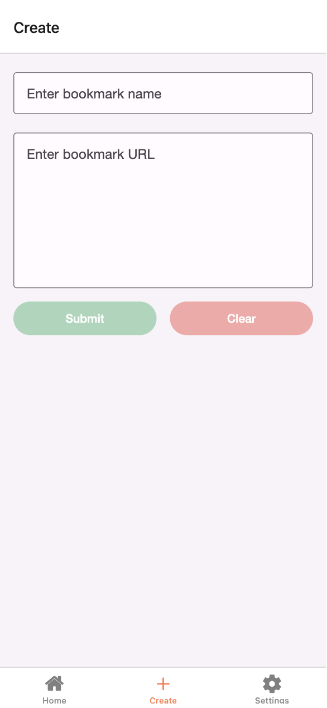

# BookmarksApp

Minimalist design react native bookmarks app + self-hosted auth server for personal use. Figma design available [here](kenf1.github.io/bookmarks-mobile/)

<table>
  <tr>
    <td style="border:1px solid #ccc; padding:8px; text-align:center;">
      
      
Login Page

    </td>
    <td style="border:1px solid #ccc; padding:8px; text-align:center;">
      
      
Home Page

    </td>
    <td style="border:1px solid #ccc; padding:8px; text-align:center;">
      
      
Create Page

    </td>
  </tr>
</table>
